# Data Flow Diagram (DFD)

This document illustrates the flow of data through the AI-powered Azure DevOps Assistant for common user scenarios. The diagrams are created using Mermaid.js.

## 1. User Sends a Simple Message (e.g., "current sprint")

This diagram shows the data flow for a deterministic command that can be handled directly by the backend.

## 2. User Creates a Work Item (e.g., "create task")

This diagram illustrates the multi-turn flow of creating a work item, which involves state management.

## 3. User Asks an AI-Powered Question

This diagram shows the flow for a natural language query that is handled by the AI service.

```mermaid
sequenceDiagram
    participant User
    participant FrontendClient as Frontend
    participant BackendServer as Server
    participant IntegrationJS as AI Service
    participant OpenRouterAPI as AI API

    User->>+Frontend: Types "what are the main risks?"
    Frontend->>+Server: emit('user_message', { text: "what are the main risks?" })
    Server->>Server: handleMessage(): No deterministic match, routes to AI
    Server->>Server: buildAIContext(): Gathers sprint stats and data
    Server->>+AI Service: queryWithAI(prompt, context)
    AI Service->>+OpenRouterAPI: POST /chat/completions
    OpenRouterAPI-->>-AI Service: Returns AI-generated response
    AI Service-->>-Server: Returns formatted AI response
    Server->>-Frontend: emit('bot_message', { html: "🤖 AI Assistant: ..." })
    Frontend-->>-User: Displays AI-powered answer
```

